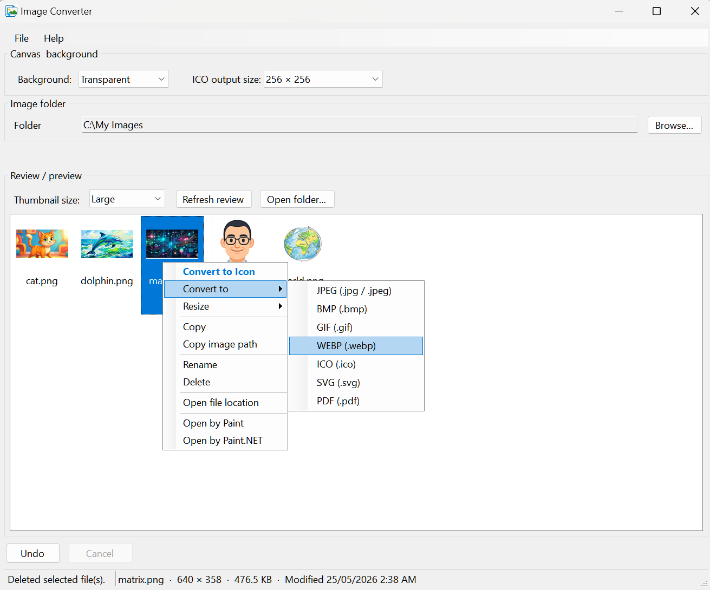

# Image Converter

Windows batch image converter with a folder **review** pane. Built with **.NET 8** WinForms and **Magick.NET**.

Licensed under the [MIT License](LICENSE).



## Quick start

1. Choose an **image folder** (Browse, **File → Open folder**, or drag a folder onto the review list).
2. Select images in the review list.
3. Right-click → **Convert to** (or **Convert to Icon** for ICO).

Conversion runs from the **context menu** (there is no main Convert button). Use **Undo** / **Cancel** on the bottom bar while a batch runs.

Converted files are written **into the same folder** (same name, new extension) and appear in the list automatically.

## Menus

**File** — Open folder (Ctrl+O), Refresh review (F5) | Open image folder in Explorer, Open application folder in Explorer | Paste image (Ctrl+V), Undo (Ctrl+Z) | Exit

**Help** — How to use (guide loaded from `HelpHowToUse.rtf`) · Support the developer · About

## Formats

**JPEG, PNG, BMP, GIF, WEBP, ICO, SVG, PDF**

- **ICO** — square size 16–256 px; white, black, or transparent letterbox; largest frame when reading multi-size icons.
- **Transparent background** — choose **Transparent (preserve alpha)** for PNG, GIF, WEBP, ICO, and SVG. Keeps existing transparency; on opaque images with a **uniform border color** (e.g. white or green screen edges), that color is keyed out. This is **not** AI background removal for busy photo backgrounds.
- **SVG** — see [SVG output](#svg-output) below (embedded image, not vector tracing).
- **PDF** — single-page raster image via ImageMagick.

### SVG output

**Convert to → SVG** does **not** trace the picture into vector paths. The app:

1. Loads the source as a bitmap (via ImageMagick).
2. Encodes it as **PNG** (respecting **Transparent** background when set).
3. Writes a valid `.svg` file that contains only an `<image>` tag with that PNG as **base64** data.

So the result is a **`.svg` wrapper around a raster image** — same pixels as a PNG, not editable curves in Illustrator/Inkscape. Zooming in far will still look pixelated.

| Use SVG here when… | Prefer PNG/WebP instead when… |
|--------------------|-------------------------------|
| A tool or site requires a `.svg` file but fixed resolution is fine | You only need a raster asset |
| You want one file that opens in browsers as SVG | You need true vector paths or smallest size for photos |

**Note:** If the source is already a vector `.svg`, it is rasterized during conversion, then wrapped again — original paths are not preserved.

## Review list

- Thumbnails with filename underneath; size: small / medium / large.
- **F5** or **Refresh review** to reload.
- **F2** or context menu **Rename** (dialog).
- Status bar: name, size, dimensions, last modified.
- **Ctrl+C** — copy path; **Ctrl+V** / **Ctrl+P** — paste image into the folder.

## Convert to (Windows Explorer)

Convert from **File Explorer** without opening the main app (same folder, new extension).

Right-click an image → **Convert to** ▶ → choose **PNG (.png)**, **JPEG (.jpg)**, etc.

Uses the Windows **SubCommands** cascade (parent menu + format submenu). If the submenu does not appear, use **Refresh Explorer menu**; registering format verbs under `HKLM` may require running the app **once as Administrator**.

- Toggle: **Windows Explorer** → **Add “Converter To” to Windows Explorer right-click menu** (on by default).
- ICO size and background use `config.ini` (same as the main app).

## Context menu (in-app review list)

**Convert to Icon** · **Convert to** (JPEG, PNG, BMP, GIF, WEBP, ICO, SVG, PDF) · **Resize** (0.5×, 0.75×, 2×, or 4×, saves as `name_scaled.ext`) · Copy · Copy image path · Rename · Delete · Open file location · Open by Paint · Open by Paint.NET

Existing output files trigger an overwrite prompt. The **Convert to** submenu skips formats the selection already uses.

## Donate

If you find this project helpful, consider buying me a coffee to support its development:

<a href="https://buymeacoffee.com/mjayyab">
  
</a>

## Notes

- The image folder must not be a drive root (e.g. `C:\`).
- Settings persist in **`%AppData%\Image Converter\config.ini`** (folder path, window layout, thumbnail size, ICO options, Explorer **Converter To** menu).
- **`HelpHowToUse.rtf`** is copied to the output folder on build; edit it in the project to change the Help guide.
- Depends on [Magick.NET-Q16-AnyCPU](https://www.nuget.org/packages/Magick.NET-Q16-AnyCPU).

## Build

**Requires:** Windows, [.NET 8 SDK](https://dotnet.microsoft.com/download/dotnet/8.0)

```bash
dotnet build ImageConverter\ImageConverter.csproj -c Release
dotnet run --project ImageConverter\ImageConverter.csproj
```

For a self-contained Windows installer payload (no separate .NET runtime required on the target PC), run:

```bash
dotnet publish ImageConverter\ImageConverter.csproj -c Release -r win-x64 --self-contained true
```

Output: `ImageConverter\bin\Release\net8.0-windows\win-x64\publish\` (includes `HelpHowToUse.rtf` and `images\splash_screen.png`). After publish, extra files in the parent `win-x64` folder are removed automatically (only `publish\` remains).

Built app (framework-dependent): `ImageConverter\bin\<Configuration>\net8.0-windows\`.
