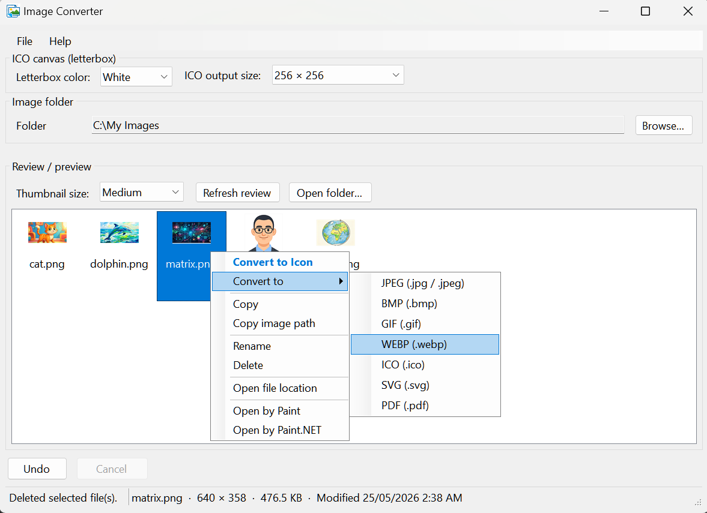

# Image Converter

Windows batch image converter with a folder **review** pane. Built with **.NET 8** WinForms and **Magick.NET**.

Licensed under the [MIT License](LICENSE).



## Quick start

1. Choose an **image folder** (Browse, **File → Open folder**, or drag a folder onto the review list).
2. Select images in the review list.
3. Right-click → **Convert to** (or **Convert to Icon** for ICO).

Conversion runs from the **context menu** (there is no main Convert button). Use **Undo** / **Cancel** on the bottom bar while a batch runs.

Converted files are written **into the same folder** (same name, new extension) and appear in the list automatically.

## Menus

**File** — Open folder (Ctrl+O) · Refresh review (F5) · Open folder in Explorer · Paste image (Ctrl+V) · Undo (Ctrl+Z) · Exit

**Help** — How to use (guide loaded from `HelpHowToUse.rtf`) · About

## Formats

**JPEG, PNG, BMP, GIF, WEBP, ICO, SVG, PDF**

- **ICO** — square size 16–256 px; white or black letterbox; largest frame when reading multi-size icons.
- **SVG** — embedded PNG (not vector tracing).
- **PDF** — single-page image via ImageMagick.

## Review list

- Thumbnails with filename underneath; size: small / medium / large.
- **F5** or **Refresh review** to reload.
- **F2** or context menu **Rename** (dialog).
- Status bar: name, size, dimensions, last modified.
- **Ctrl+C** — copy path; **Ctrl+V** / **Ctrl+P** — paste image into the folder.

## Context menu

**Convert to Icon** · **Convert to** (JPEG, PNG, BMP, GIF, WEBP, ICO, SVG, PDF) · Copy · Copy image path · Rename · Delete · Open file location · Open by Paint · Open by Paint.NET

Existing output files trigger an overwrite prompt. The **Convert to** submenu skips formats the selection already uses.

## Notes

- The image folder must not be a drive root (e.g. `C:\`).
- Settings persist in **`config.ini`** next to the executable (folder path, window layout, thumbnail size, ICO options).
- **`HelpHowToUse.rtf`** is copied to the output folder on build; edit it in the project to change the Help guide.
- Depends on [Magick.NET-Q16-AnyCPU](https://www.nuget.org/packages/Magick.NET-Q16-AnyCPU).

## Build

**Requires:** Windows, [.NET 8 SDK](https://dotnet.microsoft.com/download/dotnet/8.0)

```bash
dotnet build ImageConverter\ImageConverter.csproj -c Release
dotnet run --project ImageConverter\ImageConverter.csproj
```

Built app: `ImageConverter\bin\<Configuration>\net8.0-windows\` (includes `HelpHowToUse.rtf`).
